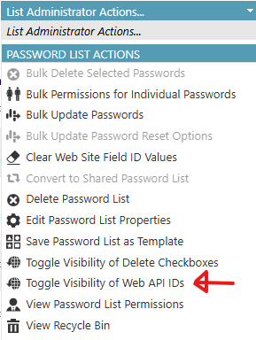
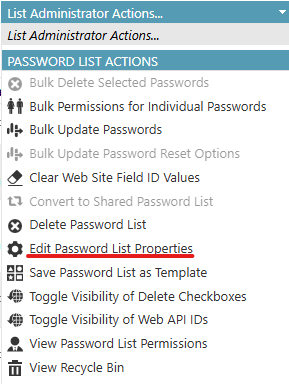
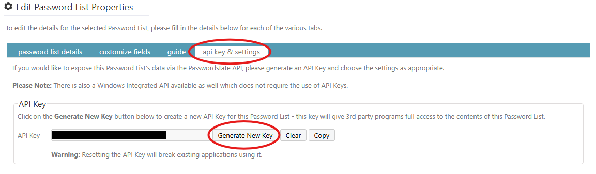

# Powershell Module: PS.PasswordState

### TL;DR

This module makes it possible to integrate with PasswordState on password lists.

Connection Example Code:
```powershell
Import-Module PS.PasswordState

$params = @{ 
    BaseUrl = "https://passwordstate"
    PasswordListId = "<PasswordListID>"
    ApiKey = "<apikey>"
}
Connect-PasswordState @params
```


## FAQ


### Where do I find the List ID?

When you are on the list, Open the dropdown menu "List Administrator Actions..." and press "Toggle Visibility of Web API IDs"




### How do I create the API Key?

1. When you are on the list, Open the dropdown menu "List Administrator Actions..." and press "Edit Password List Properties" <br>


2. Then Visit the tab "api key & settings"
3. If a key is Generated, then it may be a bad idea to replace it if other systems use it. Otherwise Generate a new key.
4. **PRESS SAVE**. Don't forget to save and then wonder why it's not working like me...
5. Press Copy and use it with the module. <br>


